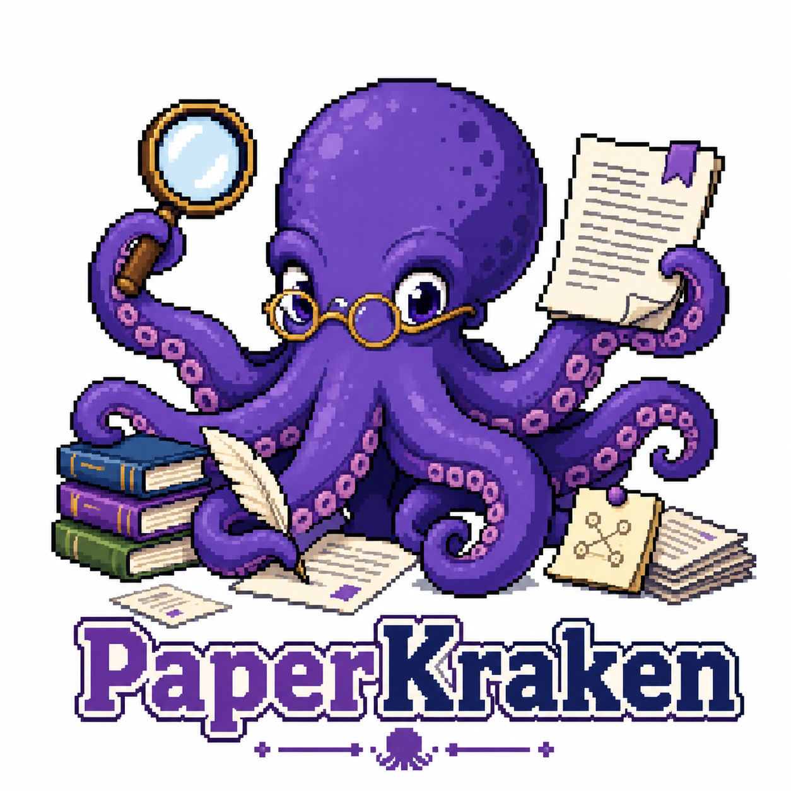
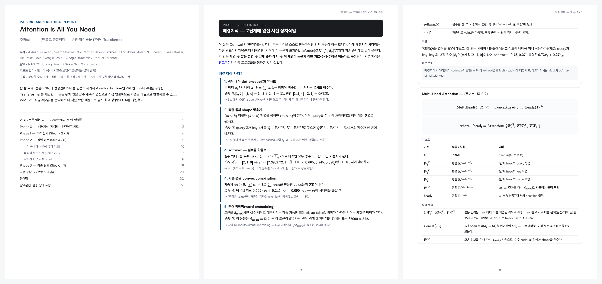
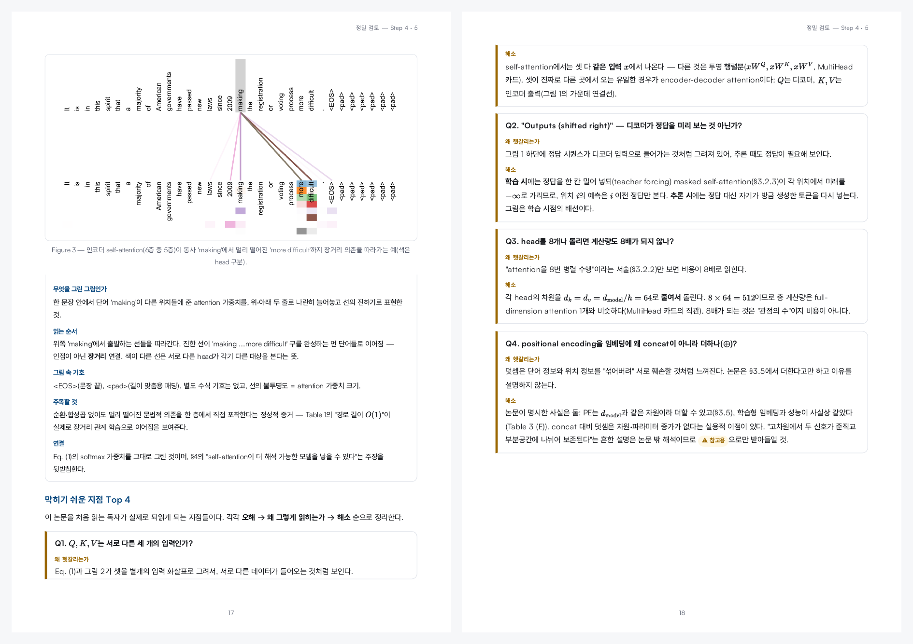

<p align="center">
  
</p>

<h1 align="center">PaperKraken</h1>

<p align="center"><b>당신의 읽기 목록에 크라켄을 풀어놓으세요.</b></p>

<p align="center"><i><a href="README.md">English</a> | 한국어</i></p>

PaperKraken은 논문 PDF를 삼켜서 **튜토리얼급 비판적 읽기 리포트**를 뱉어내는 [Claude Code](https://claude.com/claude-code) 스킬입니다. 숙련 연구자가 논문을 읽는 방식 그대로 — 배경지식부터 채우고, 모든 수식을 해부하고, 그림을 요소 단위로 해독하고, 저자의 주장을 법정에 세우는 — 과정을 담은 깔끔한 조판 PDF를 만들어냅니다.

방법론은 Jacques Cornwell이 *Nature* 커리어 칼럼에 기고한 ["Seven steps for critically analysing research papers"](https://www.nature.com/articles/d41586-026-01209-0)(2026)의 7단계 비판적 분석 프레임워크입니다. 전문가가 논문 한 편에 쓰는 1~2시간의 정독을 대신 수행하고, 그 과정을 보여줍니다.



## 무엇이 나오나

명령 하나가 들어가면 PDF 하나가 나옵니다. Transformer 논문의 경우 [한국어 22쪽](output_sam/paperkraken-attention-v2/attention-is-all-you-need-report-v2.pdf) / [영어 25쪽](output_sam/paperkraken-attention-en/attention-is-all-you-need-report-en.pdf) 리포트에 다음이 담깁니다:

| 섹션 | 하는 일 |
|---|---|
| 📖 **이 리포트를 읽는 법** | Cornwell의 3-Phase / 7단계 방법론 자체를 가르칩니다 — 리포트가 읽기 훈련을 겸합니다 |
| 🪜 **배경지식 사다리** | 사전지식을 의존 순서로 쌓아 올립니다 — 칸마다 *실제 숫자 예시*와 "이 개념이 여는 수식" 연결 |
| 🗺 **관련연구 지도** | 선행 접근의 계보 → 각각의 한계 → 이 논문의 위치. 인용은 전부 **웹 교차검증** |
| 🔬 **Step 1–3: 조감도** | 초록 문장별 해부, 핵심 가설의 원문 인용·번역·풀이, 지식 공백 지도화 |
| 🧮 **Step 4: 모든 수식, 카드 하나씩** | 원식 LaTeX 그대로 → 전체 기호표 → 항별 기능 분해 → 숫자 직관 → 의존 관계. 이론 논문은 정리/증명 카드로 대체 |
| 🖼 **원본 그림 해독** | 그림은 원본 PDF에서 크롭(절대 다시 그리지 않음)하고 박스·화살표·기호 하나하나 읽어줍니다 |
| 📊 **Step 5: 독립적 결론** | 결과 표는 셀 단위 대조 후 재조판; "숫자 자체가 말하는 것"과 "말할 수 없는 것"을 엄격히 분리 |
| ⚠️ **막히기 쉬운 지점** | 독자가 실제로 되읽게 되는 Top 3~5 지점을 오해 → 왜 그렇게 읽히는가 → 해소 순으로 |
| ⚖️ **Step 6–7: 최종 판단** | 저자 주장 vs 독립 판독, 내부 일관성 감사(Transformer 논문 본문의 41.0 vs 표의 41.8 불일치를 실제로 잡아냈습니다), 교란변수·이해충돌 점검 |
| ▶️ **직접 돌려보기** | 리포트의 숫자 예시를 재현하는 복붙 가능한 numpy 스니펫 부록 — 각 스니펫은 배송 전에 **기계로 실행해 인쇄된 출력과 대조**됩니다 |
| ✅ **자가점검 & 용어집** | 단계별 1문항, 총 7문항 — 이제 자기 말로 답할 수 있어야 하는 질문들 |



## 왜 믿을 수 있나

논문 밖 배경지식이야말로 LLM 리포트가 썩기 쉬운 지점입니다. PaperKraken은 모든 외부 지식에 **검증 프로토콜**을 돌립니다:

- 인용 선행연구 요약은 **실제 arXiv/출판사 초록을 가져와 읽은 내용만** — 기억에 의존하지 않습니다.
- 서지정보는 교차 대조하며, 찾지 못한 문헌은 절대 인용하지 않습니다.
- 수학 정의는 수록 전에 숫자 예시로 자체 검산합니다.
- 그 숫자 예시 자체도 **코드로 실행해 검산**합니다(`verify_snippets.py`): "직접 돌려보기" 스니펫의 stdout을 리포트에 인쇄된 숫자와 diff하고, 불일치하면 렌더링이 차단됩니다. 계산 예시가 조용히 틀린 채 나갈 수 없는 구조입니다.
- 검증에 실패한 내용은 제외하거나 **"⚠ 미검증 — 모델 지식"** 배지를 달아 명시합니다. 검증된 항목은 전부 확인 날짜가 붙은 출처 각주를 답니다.

PDF 자체도 배송 전 **필수 시각 QA 루프**를 통과해야 합니다: 페이지를 이미지로 렌더해 폰트 깨짐, 수식 렌더 실패, 크롭 잘림, 고아 제목, 백지에 가까운 페이지를 검사하고, 불합격이면 고쳐서 재렌더합니다.

## 인쇄 품질

- 로컬 번들 MathJax의 **SVG 수식** — 폰트 문제로 수식이 깨질 수 없는 구조.
- 번들된 Pretendard·Satoshi 가변 폰트로 **한글+라틴 타이포그래피** (`word-break: keep-all`).
- Paged.js 기반 **진짜 페이지네이션**: 페이지 번호, 현재 Phase를 보여주는 러닝 헤더, 페이지 번호가 살아있는 표지 목차, 페이지를 행 단위로 흐르는 수식 카드(반쪽짜리 빈 페이지 없음).
- 렌더 후 **PDF 북마크(사이드바 목차)** 자동 주입 — 어느 뷰어에서든 섹션 트리로 이동.
- 전부 로컬 번들이라 오프라인에서도 렌더링됩니다.

## 기존 스킬들과의 비교

논문 읽기 스킬은 이미 많습니다. 크게 네 계열 — 요약기, 학습자료 생성기, 해설 아티클/슬라이드 제작기, 심사자(referee)형 리뷰어 — 로 나뉘고, 각자 자기 일은 잘합니다. PaperKraken의 주장은 **조합**입니다: 깊은 이해와 체계적 검증을 인쇄급 산출물 하나에 담은 스킬은 저희가 조사한 범위에선 없었습니다.

| | arXiv 요약기 | 학습자료 생성기 | 아티클/슬라이드 제작기 | 심사자형 리뷰어 | **PaperKraken** |
|---|:-:|:-:|:-:|:-:|:-:|
| 출판된 읽기 방법론 (Nature 7단계) | — | — | — | 심사용 프레임워크 | ✅ 독자에게 방법론 자체를 가르침 |
| *모든* 번호 수식의 항별 분석 | — | 렌더만, 분석 없음 | 핵심 수식만 | — | ✅ + 이론 논문용 정리/증명 카드 |
| 출처 배지 달린 웹 검증 배경지식 | — | — | — | — | ✅ abstract를 실제로 가져와 대조 |
| 숫자 예시의 기계 실행 검산 | — | 코드 데모는 있으나 본문과 미대조 | — | — | ✅ 불일치 시 렌더링 차단 |
| 원본 그림 크롭 + 요소별 해설 | — | 추출만, 해설 없음 | 부분적 | — | ✅ 크롭 QA 기준 포함 |
| *독자*를 위한 비판적 감사 (독립 결론·일관성 검사·COI) | — | — | — | 저널 심사자용 | ✅ 실제 41.0 vs 41.8 불일치 검출 |
| 인쇄급 PDF (페이지네이션·러닝 헤더·북마크·한글) | markdown | markdown + 웹뷰어 | HTML / PPTX | markdown | ✅ + 배송 전 시각 QA 루프 |
| 한국어 + 영어 리포트 | — | 문서만 | 中/英 | — | ✅ 리포트 전체를 양쪽 언어로 |

플래시카드, 슬라이드 덱, 실행 가능한 재구현이 필요하다면 다른 계열들이 훌륭하고, 상호보완적입니다. 하지만 **논문 한 편을 정말로 이해하고 비판적으로 평가**하고 싶다면 — 모든 주장이 추적 가능한 형태로 — 그게 PaperKraken입니다.

## 설치

요구사항: [Claude Code](https://claude.com/claude-code), Node.js ≥ 18, [uv](https://docs.astral.sh/uv/), `poppler-utils`(QA용 `pdftoppm`).

**방법 A — 플러그인 마켓플레이스 (권장).** Claude Code 안에서:

```
/plugin marketplace add devwoo41/PaperKraken
/plugin install paperkraken@paperkraken
```

**방법 B — 수동 설치 (개인 스킬로):**

```bash
git clone https://github.com/devwoo41/PaperKraken.git PaperKraken
ln -s "$(pwd)/PaperKraken" ~/.claude/skills/paperkraken
```

**공통 — 렌더러 의존성 (1회):**

```bash
npm install -g playwright-core
npx playwright install chromium
```

## 사용법

Claude Code 세션에서:

```
> PaperKraken으로 이 논문 읽어줘: ~/papers/attention.pdf
> Read this paper with PaperKraken: https://arxiv.org/abs/1706.03762
```

질문은 딱 하나 — 리포트 언어(**한국어/영어**) — 나머지는 전부 자동입니다. 산출물은 논문 옆에 생성됩니다:

```
paperkraken-<논문-슬러그>/
├── <논문-슬러그>-report.pdf   ← 최종 산출물
├── report.html                ← 수정 가능한 소스 (언제든 재렌더)
├── figures/                   ← 검수된 원본 크롭
└── assets/                    ← 폰트·MathJax·Paged.js (자체 완결)
```

로컬 PDF, arXiv 링크, (페이지 이미지 폴백으로) 스캔 PDF까지 지원합니다. ML·실험과학·이론·임상 논문 각각에 맞는 방법론 감사 체크리스트가 적용됩니다.

## 동작 방식

```
paper.pdf ──▶ 전체 정독 ──▶ 그림 추출 ──▶ 웹 검증 ──▶ report.html
               (유형 판별,     (캡션 탐지,      (초록 직접 읽기,    (7단계
                수식 목록,      크롭, 시각 검수,   교차 대조,          구조)
                수치 장부)      재크롭)           배지)                 │
                                                                      ▼
                                                              스니펫 검산
                                                              (숫자 예시를 실행해
                                                               인쇄 출력과 diff)
                                                                      │
                                                                      ▼
    최종 산출물 ◀── 시각 QA 루프 ◀── 북마크 주입 ◀── Paged.js+MathJax 렌더
                   (폰트·수식·크롭·                  (Playwright Chromium,
                    밀도·고아 페이지)                 조판 완료 플래그 대기)
```

## 저장소 구조

```
PaperKraken/
├── SKILL.md                     # 스킬 본체: 워크플로 + QA 게이트
├── references/
│   ├── methodology.md           # Cornwell 7단계 → 리포트 섹션; 논문 유형별 감사 체크리스트
│   ├── equation-analysis.md     # 수식 카드 & 정리/증명 카드 규칙
│   ├── verification.md          # 외부 지식 할루시네이션 방지 프로토콜
│   └── report-template.md       # HTML/CSS 스켈레톤 + 레이아웃·밀도 규칙
├── scripts/
│   ├── extract_figures.py       # 캡션 기반 그림 크롭 (PyMuPDF)
│   ├── render_pdf.mjs           # HTML → PDF, MathJax+Paged.js 완료 대기
│   ├── add_bookmarks.py         # 리포트 제목으로 PDF 북마크 주입
│   ├── verify_snippets.py       # 부록 스니펫 실행, 인쇄 출력과 diff
│   └── render_pdf.sh            # 레거시 1-shot CLI 폴백
├── assets/                      # Pretendard · Satoshi · MathJax · Paged.js (전부 로컬)
├── docs/                        # README 미리보기 이미지
└── output_sam/                  # 예시 리포트: "Attention Is All You Need" (영어 25쪽 · 한국어 22쪽)
```

## 크레딧

- 방법론: Jacques Cornwell, *"Seven steps for critically analysing research papers"*, Nature Career Column, 2026.
- 렌더링: [MathJax](https://www.mathjax.org/) (Apache-2.0), [Paged.js](https://pagedjs.org/) (MIT), [Playwright](https://playwright.dev/) (Apache-2.0), [PyMuPDF](https://pymupdf.readthedocs.io/) (AGPL-3.0).
- 서체: [Pretendard](https://github.com/orioncactus/pretendard) (OFL-1.1), [Satoshi](https://www.fontshare.com/fonts/satoshi) (ITF FFL).

---

*PaperKraken이 오후 하나를 아껴줬다면, ⭐ 하나가 크라켄의 먹이가 됩니다.*
