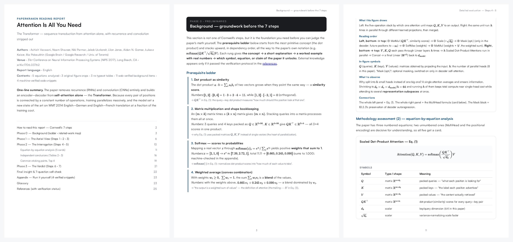
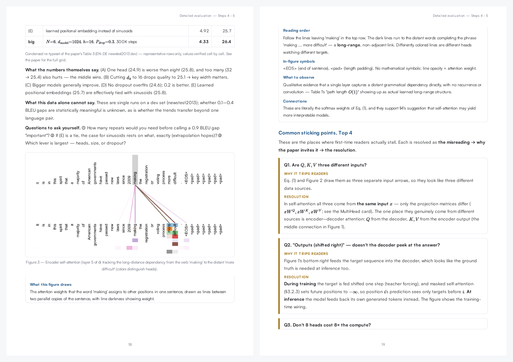

<p align="center">
  
</p>

<h1 align="center">PaperKraken</h1>

<p align="center"><b>Release the kraken on your reading list.</b></p>

<p align="center"><i>English | <a href="README.ko.md">한국어</a></i></p>

PaperKraken is a [Claude Code](https://claude.com/claude-code) skill that swallows a research-paper PDF and produces a **tutorial-grade critical-reading report** — a clean, typeset PDF that walks you through the paper the way an experienced researcher would read it: background first, every equation dissected, figures decoded element by element, and the authors' claims put on trial.

It is built on the 7-step critical-analysis methodology from Jacques Cornwell's *Nature* career column, ["Seven steps for critically analysing research papers"](https://www.nature.com/articles/d41586-026-01209-0) (2026) — the 1–2 hours of expert reading, performed for you, with the process shown.



## What you get

One command in, one PDF out. For the Transformer paper, that PDF is [25 pages](output_sam/paperkraken-attention-en/attention-is-all-you-need-report-en.pdf) (English) or [22 pages](output_sam/paperkraken-attention-v2/attention-is-all-you-need-report-v2.pdf) (Korean) containing:

| Section | What it does |
|---|---|
| 📖 **How to read this report** | Teaches Cornwell's 3-phase / 7-step method itself, so the report doubles as training |
| 🪜 **Prerequisite ladder** | Background concepts stacked in dependency order — each rung with a *real-number worked example* and "which equation this unlocks" |
| 🗺 **Related-work map** | Lineages of prior approaches → each one's limitation → where this paper fits, with **web-verified** citations |
| 🔬 **Steps 1–3: Aerial view** | Abstract dissected sentence by sentence; the core hypothesis quoted, translated, and unpacked; the knowledge gap mapped |
| 🧮 **Step 4: Every equation, one card each** | Exact LaTeX transcription → full symbol table → term-by-term functional roles → numeric intuition → dependency chain. Theory papers get theorem/proof cards instead |
| 🖼 **Original figures, decoded** | Figures are cropped from the source PDF (never redrawn) and read element by element: every box, arrow, and symbol |
| 📊 **Step 5: Independent conclusions** | Results tables re-typeset and cell-verified; "what the numbers alone say" strictly separated from "what they can't say" |
| ⚠️ **Common sticking points** | The Top 3–5 places readers actually stall, each resolved: misreading → why the paper invites it → resolution |
| ⚖️ **Steps 6–7: The verdict** | Author claims vs. independent reading, an internal-consistency audit (it caught the Transformer paper saying 41.0 BLEU in §6.1 vs 41.8 in Table 2), confounders, and conflicts of interest |
| ▶️ **Run it yourself** | An appendix of copy-paste numpy snippets reproducing the report's numeric examples — each one **machine-executed and diffed against its printed output** before the report ships |
| ✅ **Self-check & glossary** | 7 questions (one per step) you should now be able to answer in your own words |



## Why it's trustworthy

Background knowledge beyond the paper is where LLM reports usually rot. PaperKraken runs a **verification protocol** on every external claim:

- Cited prior work is summarized **only from its actual arXiv/publisher abstract**, fetched and read — never from memory.
- Bibliographic details are cross-checked; nothing unfindable is ever cited.
- Math definitions are self-tested with numeric examples before they're included.
- The numeric examples themselves are **executed as code** (`verify_snippets.py`): every "Run it yourself" snippet's stdout is diffed against the number printed in the report, and a mismatch blocks rendering. The worked examples cannot be silently wrong.
- Anything that fails verification is dropped, or shipped with an explicit **"⚠ unverified — model knowledge"** badge. Every verified item carries a source footnote with its check date.

And the PDF itself goes through a **mandatory visual QA loop** before delivery: pages are rasterized and inspected for broken glyphs, failed math rendering, clipped figure crops, orphaned headings, and near-blank pages. If QA fails, the report is fixed and re-rendered — not shipped.

## Print quality

- **Math as SVG** via locally bundled MathJax — equations can't fall victim to missing fonts.
- **Korean + Latin typography** with bundled Pretendard and Satoshi (variable fonts, `word-break: keep-all`).
- **Real pagination** via Paged.js: page numbers, running headers showing the current Phase, a cover TOC with live page references, and equation cards that flow across pages row by row instead of leaving half-empty pages.
- **PDF outline (sidebar bookmarks)** injected after rendering — the full section tree is navigable in any viewer.
- Everything is bundled locally; rendering works offline.

## How it compares

There are many paper-reading skills. They cluster into four families — summarizers, study-material generators, interpretive-article writers, and referee-style reviewers — and each does its one thing well. PaperKraken's claim is the **combination**: no other skill we found pairs deep comprehension with systematic verification in a print-grade deliverable.

| | arXiv summarizers | Study-material generators | Article/slide writers | Referee-style reviewers | **PaperKraken** |
|---|:-:|:-:|:-:|:-:|:-:|
| Published reading methodology (Nature 7-step) | — | — | — | review frameworks, for referees | ✅ taught to the reader |
| *Every* numbered equation, term by term | — | rendered, not analyzed | key formulas only | — | ✅ + theorem cards for theory papers |
| Web-verified background with source badges | — | — | — | — | ✅ abstracts actually fetched & diffed |
| Numeric examples machine-executed before shipping | — | code demos, unchecked vs. text | — | — | ✅ mismatch blocks the render |
| Original figures cropped & read element-by-element | — | extracted, not read | partial | — | ✅ with crop QA criteria |
| Critical audit for the *reader* (independent conclusions, consistency check, COI) | — | — | — | for journal referees | ✅ caught a real 41.0-vs-41.8 discrepancy |
| Print-grade PDF (pagination, running headers, bookmarks, CJK) | markdown | markdown + web viewer | HTML / PPTX | markdown | ✅ + visual QA loop before delivery |
| Korean + English reports | — | docs only | CN/EN | — | ✅ full report in either |

If you want flashcards, slide decks, or runnable re-implementations, those other families are great — and complementary. If you want to *actually understand and critically evaluate one paper*, with every claim traceable, that's PaperKraken.

## Installation

Requirements: [Claude Code](https://claude.com/claude-code), Node.js ≥ 18, [uv](https://docs.astral.sh/uv/), and `poppler-utils` (`pdftoppm`, used for QA).

**Option A — plugin marketplace (recommended).** Inside Claude Code:

```
/plugin marketplace add devwoo41/PaperKraken
/plugin install paperkraken@paperkraken
```

**Option B — manual, as a personal skill:**

```bash
git clone https://github.com/devwoo41/PaperKraken.git PaperKraken
ln -s "$(pwd)/PaperKraken" ~/.claude/skills/paperkraken
```

**Either way, one-time renderer deps:**

```bash
npm install -g playwright-core
npx playwright install chromium
```

## Usage

In any Claude Code session:

```
> Read this paper with PaperKraken: ~/papers/attention.pdf
> PaperKraken으로 이 논문 읽어줘: https://arxiv.org/abs/1706.03762
```

You'll be asked one question — report language, **Korean or English** — and everything else is automatic. The output lands next to the paper:

```
paperkraken-<paper-slug>/
├── <paper-slug>-report.pdf   ← the deliverable
├── report.html               ← editable source (re-render any time)
├── figures/                  ← verified original crops
└── assets/                   ← fonts, MathJax, Paged.js (self-contained)
```

Works with local PDFs, arXiv links, and (via page-image fallback) even scanned PDFs. ML, experimental-science, theory, and clinical papers each get a type-appropriate methodology audit.

## How it works

```
paper.pdf ──▶ full read ──▶ figure extraction ──▶ web verification ──▶ report.html
                (type,          (caption-detect,      (abstracts read,       (7-step
                 equations,      crop, visual          cross-checked,         structure)
                 number ledger)  check, re-crop)       badged)                   │
                                                                                 ▼
                                                                     snippet verification
                                                                     (numeric examples
                                                                      executed & diffed)
                                                                                 │
                                                                                 ▼
     deliverable ◀── visual QA loop ◀── bookmarks ◀── Paged.js + MathJax render
                     (tofu, math, crops,               (Playwright Chromium,
                      density, orphans)                 waits for typeset flag)
```

## Repository layout

```
PaperKraken/
├── SKILL.md                     # the skill: workflow + QA gates
├── references/
│   ├── methodology.md           # Cornwell's 7 steps → report sections; per-type audit checklists
│   ├── equation-analysis.md     # equation-card & theorem-card rules
│   ├── verification.md          # anti-hallucination protocol for external knowledge
│   └── report-template.md       # HTML/CSS skeleton + layout & density rules
├── scripts/
│   ├── extract_figures.py       # caption-anchored figure cropping (PyMuPDF)
│   ├── render_pdf.mjs           # HTML → PDF, waits for MathJax + Paged.js
│   ├── add_bookmarks.py         # injects the PDF outline from report headings
│   ├── verify_snippets.py       # executes appendix snippets, diffs vs printed output
│   └── render_pdf.sh            # legacy one-shot CLI fallback
├── assets/                      # Pretendard · Satoshi · MathJax · Paged.js (all local)
├── docs/                        # README previews
└── output_sam/                  # sample reports: "Attention Is All You Need" (EN 25 pp · KO 22 pp)
```

## Credits

- Methodology: Jacques Cornwell, *"Seven steps for critically analysing research papers"*, Nature Career Column, 2026.
- Rendering: [MathJax](https://www.mathjax.org/) (Apache-2.0), [Paged.js](https://pagedjs.org/) (MIT), [Playwright](https://playwright.dev/) (Apache-2.0), [PyMuPDF](https://pymupdf.readthedocs.io/) (AGPL-3.0).
- Type: [Pretendard](https://github.com/orioncactus/pretendard) (OFL-1.1), [Satoshi](https://www.fontshare.com/fonts/satoshi) (ITF FFL).

---

*If PaperKraken saved you an afternoon, a ⭐ keeps the kraken fed.*
